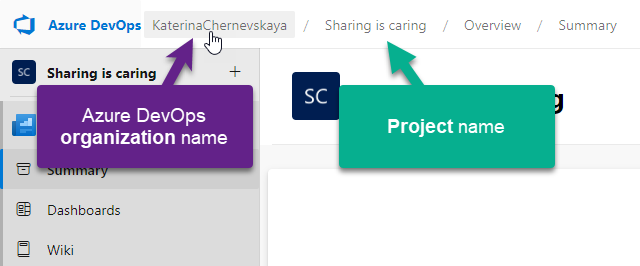

# Baltic Summit 2023 - ALM Workshop

This workshop will introduce you to the concepts and best practices of Application Lifecycle Management (ALM) in Power Platform. You will learn how to use solutions, environments, and deployment tools to manage your apps and data across different stages of development, testing, and production. You will also explore how to automate and monitor your ALM processes using Power Automate and Azure DevOps.

For an optimal workshop experience, please familiarize yourself with and adhere to the following prerequisites.
1. Device: Ensure you have a laptop ready.
2. [Tenant](https://github.com/Katerina-Chernevskaya/BalticSummit2023#tenant) for Labs that allow you create environments and App Registration (details are bellow).
3. [Azure DevOps organization](https://github.com/Katerina-Chernevskaya/BalticSummit2023#azure-devops-organization---parallel-job-request) with 1 free tier of Parallel Job (details are below).

## Tenant

For this workshop, a **Microsoft 365 tenant** is required. While any Microsoft 365 license would suffice, it's beneficial to have a license that supports Outlook, Teams and SharePoint functionalities. Even a trial version of Microsoft 365 will serve the purpose. Consider registering for the `Microsoft 365 Business Basic - Trial` [here](https://signup.microsoft.com/get-started/signup?products=91dcd8b1-3b1b-444d-9cdb-0bc0da3eb40d&mproducts=CFQ7TTC0LH18:0002&fmproducts=CFQ7TTC0LH18:0002&culture=en-us&country=us&ali=1). Note that while credit card details are needed during registration, no charges are applied initially. This trial offers 25 user licenses for a month at no cost. After this period, you can decide to either cancel the subscription or continue with a paid plan, adjusting the user count as needed.

Once you create a fresh new tenant - start the free [Power Apps Developer plan](https://powerapps.microsoft.com/en-us/developerplan/) that allows you to create up to 3 developer environments and use most of the Premium features.

## Azure DevOps organization - Parallel job request

While we'll dive deep into Azure DevOps setup during our workshop, we request that you initiate the Parallel Job feature in advance using this guide. This is crucial as the free tier for parallelism typically requires a 2-day approval. Follow the below steps to set your Azure DevOps organization prepared in advance to make the most of our workshop.

1. Go to https://dev.azure.com/
2. Complete the project creation form and click `Continue`
3. Once the project will be created, navigate to the [Azure DevOps Parallelism Request form](https://forms.office.com/pages/responsepage.aspx?id=v4j5cvGGr0GRqy180BHbR63mUWPlq7NEsFZhkyH8jChUMlM3QzdDMFZOMkVBWU5BWFM3SDI2QlRBSC4u), answer the four provided questions and then submit the form.
- in the question `What is your name?` write your name
- in the question `What is your email address?` write your email address from the tenant for which you make the request
- in the question `What is the name of your Azure DevOps Organization?` write the link to your Azure DevOps organizatopn (like https://dev.azure.com/KaterinaChernevskaya)
_To locate this link, click on the organization name associated with your newly created project and copy the URL from the address bar._

- in the question `Are you requesting a parallelism increase for Public or Private projects?` select `Private`

