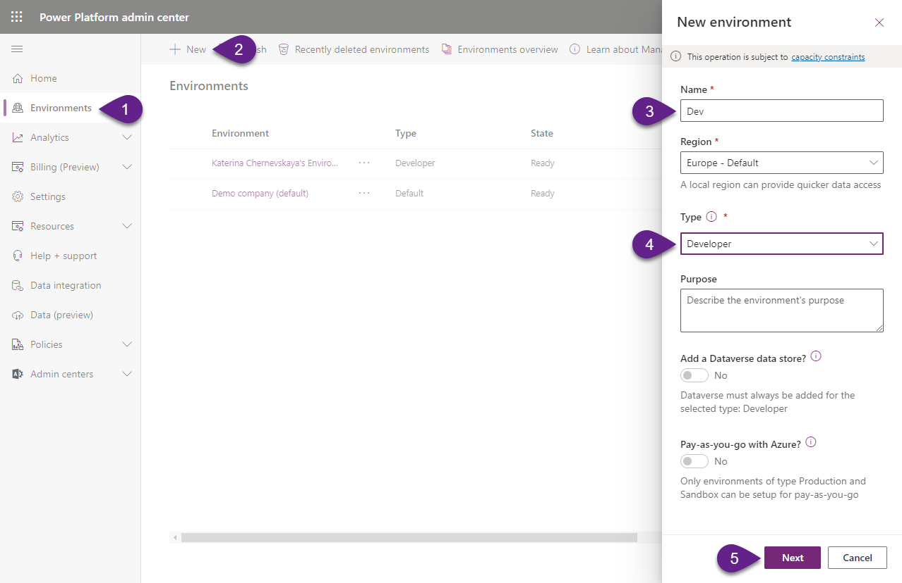
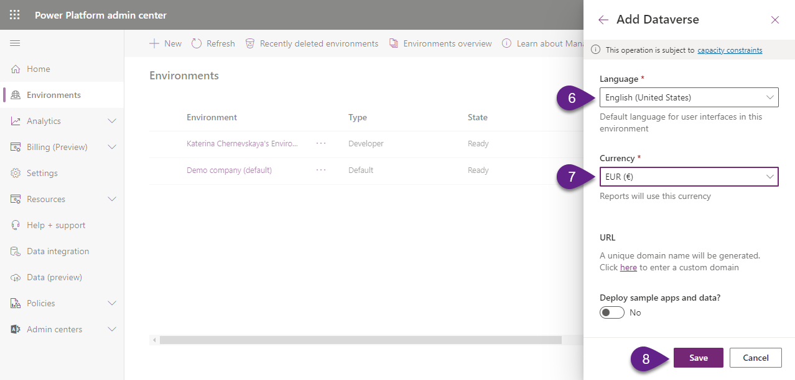
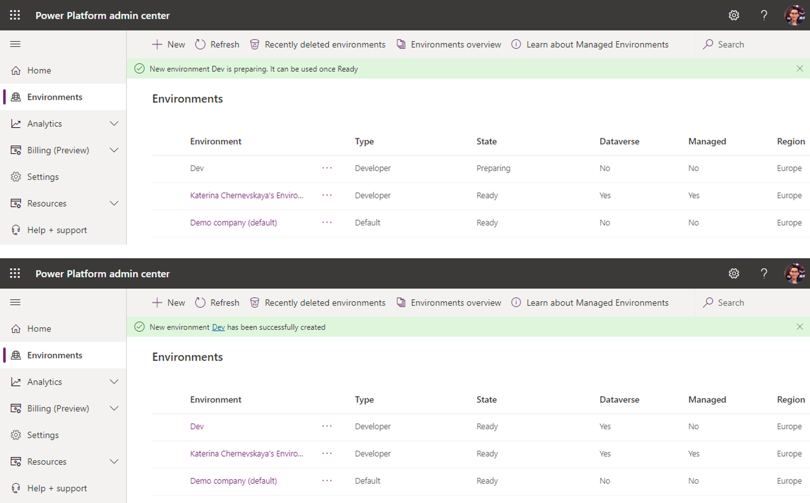

In this segment of our journey at the "Solution Spaceport," we will be venturing into the creation of a Developer-type environment, a crucial hub for all your developmental undertakings. As we forge this new environment with the support of Dataverse, you'll be equipped with a space that is tailored for exploration, innovation, and the seamless development of solutions.

# 1. Create a new Environment (Dev)
1. Navigate to [https://admin.powerplatform.microsoft.com/](https://admin.powerplatform.microsoft.com/)
2. Select `Environments` on the left-hand menu.

:exclamation: _Note:
If you've recently set up a new tenant, it will automatically include a Default environment. Additionally, initiating the Power Apps Developer plan will grant you access to a Developer environment._

3. Fill in the form:
- `Name` - write `Dev`
- `Type` - choose `Developer`

Click `Next` to go to the next screen
- `Language` - choose `English (United States)`
- `Currency` - choose `EUR`

Click `Save` to initiate the provisioning of the new environment.

During the provisioning the `State` of the new environment will be `Preparing`. Once the environment will be created the `State` will switch to `Ready`.

***

# 2. Create a new Environment (Test)
1. Navigate to [https://admin.powerplatform.microsoft.com/](https://admin.powerplatform.microsoft.com/)

2. Select `Environments` on the left-hand menu.

3. Fill in the form:
- `Name` - write `Test`
- `Type` - choose `Developer`

Click `Next` to go to the next screen
- `Language` - choose `English (United States)`
- `Currency` - choose `EUR`

Click `Save` to initiate the provisioning of the new environment.

***
