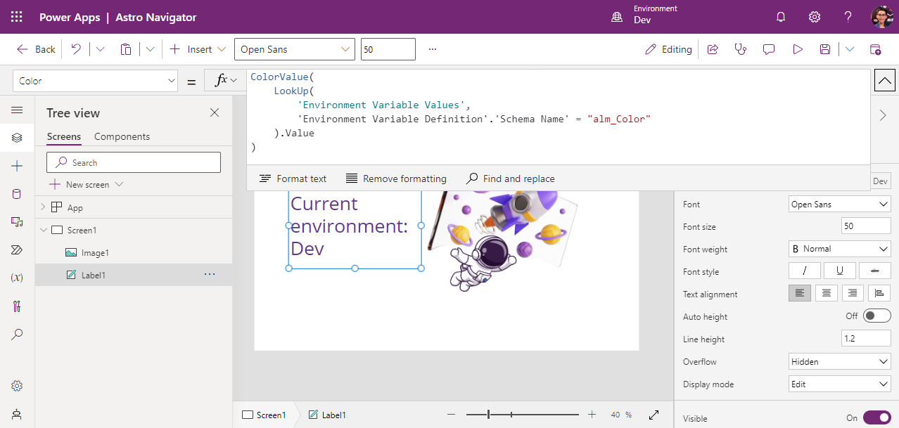

In this lab, we will embark on the exciting journey of constructing a new solution from the ground up, laying the foundation by creating initial components within this solution. This cornerstone solution will be our reliable companion throughout almost the entire workshop.


# 1. Create a new Solution

1. Navigate to [https://make.powerapps.com](https://make.powerapps.com).

2. Switch to the `Dev` environment that you created during the **Lab 2**.


3. Navigate to `Solutions` on the left-hand menu.

4. Click `+ New solution`

5. On the opened tab click `+ New publisher`


6. Fill in the form to create a new (your) publisher:
- `Display Name` - Enter your name here; spaces are permissible.
- `Name` - Provide the schema name; note that spaces are not allowed.
- `Prefix` - Input a few characters that will be appended to the beginning of an object's name.

Click `Save`.


7. Fill in the rest of fields in the `New solution` screen:
- `Display name` - Enter `Galactic Guide`.
- `Publisher` - Choose the Publisher that you've created on the previous step in this Lab.

Click `Create`.


The new created solution should be opened automatically. Click on the back arrow to navigate to Solutions and see the new solution in the solutions list.


***

# 2. Add Environment variables

1. Open your solution `Galactic Guide'

## Environment variable "CurrentEnvironment"

1. Click `+ New` -> `More` -> `Environment variable`.


2. Fill in the following fields:
- `Display name` - `CurrentEnvironment`
- `Data Type` - choose `Text`
- `Default Value` - `Dev`

Click `+ New value` in the `Current Value` section.


- `Current Value` - `Dev`

Click `Save`


## Environment variable "Color"

1. Click `+ New` -> `More` -> `Environment variable`.

2. Fill in the following fields:
- `Display name` - `Color`
- `Data Type` - choose `Text`
- `Default Value` - `#67319C`
- `Current Value` - `#67319C`

Click `Save`


By the end of this task two environment variables should be in your solution:


***

# 3. Add a Canvas app

## Create an app

1. Click `+ New` -> `App` -> `Canvas app`.


2. In the field `App name` enter `Astro Navigator` and click `Create`.


## Upload image

1. You can use your own picture or you can download a sample image [here](https://github.com/Katerina-Chernevskaya/BalticSummit2023/blob/main/labs/assets/2-SolutionSpaceport.png).


2. In Power Apps Studio navigate to `Media`, click `Upload`. Select the picture which you downloaded previously and click `Open`.


## Add data

1. Navigate to `Data`, click `+ Add data`. In the search bar type `var` and add both tables `Environment Variable Definitions` and `Environment variable Values`.

:exclamation: _Note:
Adding multiple tables simultaneously is not possible; please add them one at a time._


## Add controls

1. Navigate to `Insert`.

2. In the `Popular` section select 'Text label`.


3. Open the `Media` section and select `Image`.


Now both controls should be on the canva.

4. click `Tree view` to check it.


## Configure controls

1. Adjust the size and position of both controls to your preference.

2. Click on the `Image1` control and in the property `Image` on the right-hand side bar choose `2-SolutionSpaceport` image.


3. Click on the `Label1` control and for the property `Text` write the following formula:

```
"Current environment: " &
LookUp(
    'Environment Variable Values',
    'Environment Variable Definition'.'Schema Name' = "alm_CurrentEnvironment"
).Value
```


4. Update the property `Color` for the control `Label1` with the following formula:

```
ColorValue(
    LookUp(
        'Environment Variable Values',
        'Environment Variable Definition'.'Schema Name' = "alm_Color"
    ).Value
)
```



## Save and publish app

1. Click `Save`.

2. Once the save process completed, click `Publish`. in the pop-up window click `Publish this version` to confirm.


When you have done, click `Back' to go back to the solution.

***
