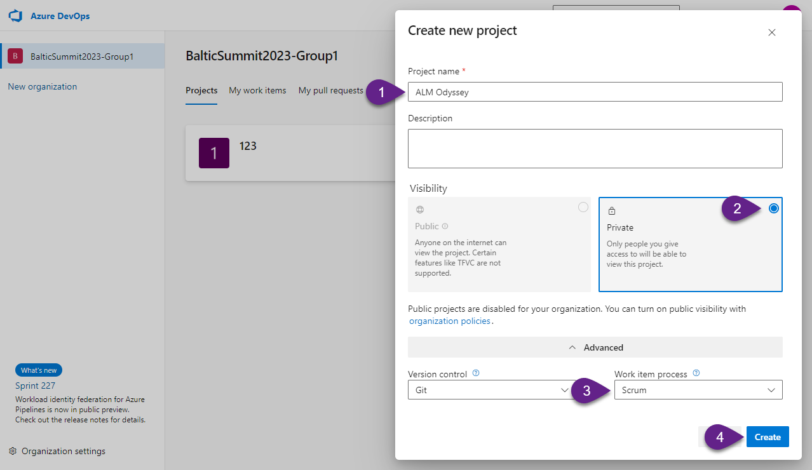
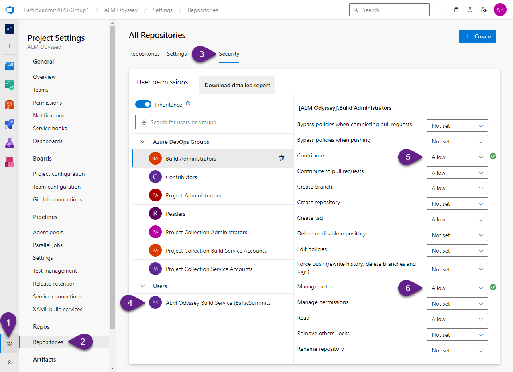
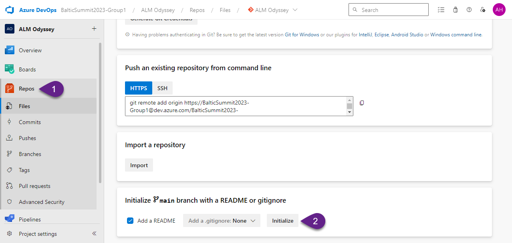
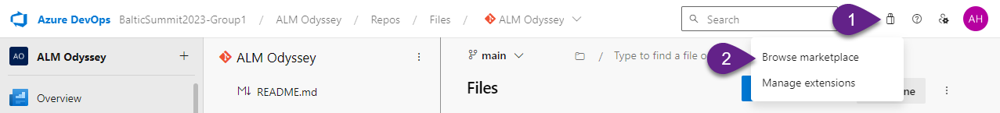
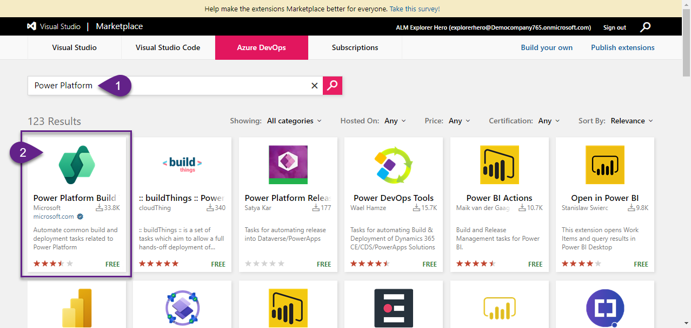

Welcome to the pivotal lab where we embark on a journey to set up the backbone of our automated development lifecycle - the Azure DevOps Organization and Project.

Azure DevOps stands as a fortress in the software development landscape, equipped with a diverse arsenal of tools designed to streamline the development process from start to finish. In this lab, we delve deep into the core of Azure DevOps, navigating through the creation and configuration of organizations and projects, the foundational elements that hold the potential to orchestrate seamless development workflows.

# 1. Create a new Project

1. Navigate to your Azure DevOps Organization.

:exclamation: _Note:
The link should be like this:_ `https://dev.azure.com/<YOUR ORGANIZATION NAME>`
_Please replace `<YOUR ORGANIZATION NAME>` with the name of the Azure DevOps organization (not with the tenant name)._

2. Click `+ New Project`.

3. Fill in the form:
`Project name` - Enter `ALM Odyssey`
`Visibility` - Choose `Private`
`Work item process` - choose `Scrum`

Click `Create`.

***

# 2. Manage permissions

1. Go to the Project settings by clicking on the `Settings` button. 

2. Click on the `Repositories` on the left-hand menu. 

3. Open `Security` tab.

4. Select the team `ALM Odyssey Build Service` under the Users section and allow for this team the following options:
- Contribute
- Manage notes

These permissions will be needed to store code in the repository and to commit changes.

***

# 3. Initialize a branch in the repository

1. Navigate to `Repos`.

2. Click `Initialize`.

The branch main will be created and you'll see the `README.md` file of this branch. Later if needed you will be able to customize this README file.

***

# 4. Install Power Platform Build Tools

The last preparation step for our Azure DevOps is `Power Platform Build Tools` installation. This extension provides actions that we will need to configure our pipelines.

1. Navigate to the `Marketplace` button and choose `Browse marketplace` option.

2. On the Marketplace page in the search field type "Power Platform" and hit Enter. 

3. Choose the `Power Platform Build Tools` extension.

4. On the next screen click `Get it free`, and then click `Install`.

After the installation process will be completed - go back to your Azure DevOps project (click `Proceed to organization` and select the project `ALM Odyssey`).

:exclamation: _Note:
Keep in mind that Power Platform Build Tools extension installs to the entire Azure DevOps organization. So your next projects you'll create in this particular DevOps organizations will automatically have permissions for Power Platform Build Tools without additional its installation._

***
