As we navigate deeper into the "DevOps Dominion" milestone, we arrive at a critical juncture where the fruits of our labor take a significant stride towards becoming a part of a streamlined, managed, and collaborative developmental journey.

Azure Repos stands as a vigilant custodian, hosting our precious solutions and granting secure, version-controlled access to the team members. The time has come to entrust our meticulously crafted Power Platform solution to the Azure Repos, facilitating a hub of collaboration and version control where innovations flourish and solutions mature with collective intelligence and insight.


# 1. Create the first pipeline

1. Navigate to `Pipelines` by clicking this button on the left-hand menu.

2. Click `Create Pipeline`.

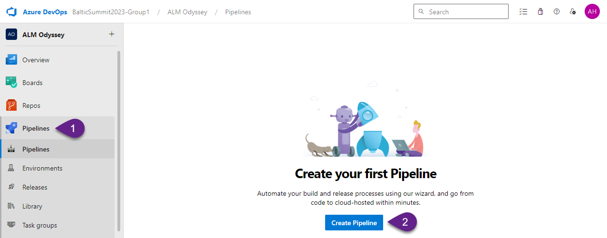

3. Click `Use the classic editor` on this screen to start creating the pipeline from scratch without a code.

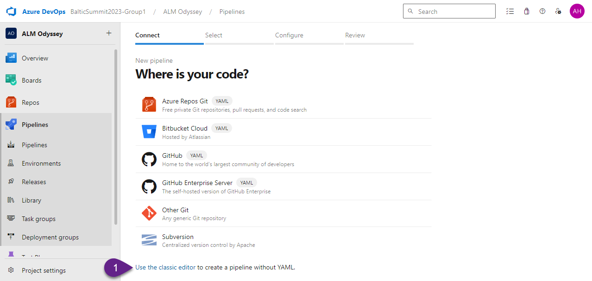

4. Click `Continue` to proceed.

:exclamation: _Note:
Before click Continue, check that everything selected correctly. Usually preselected options are correct, especially for the new project when you have just one team, one branch, etc._

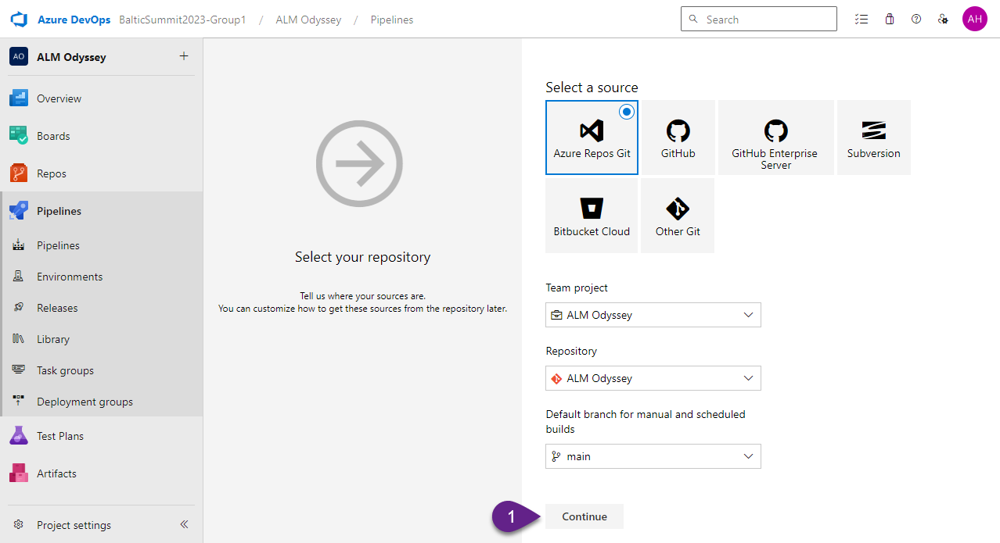

5. Choose `Empty job` as we are going to start from scratch.

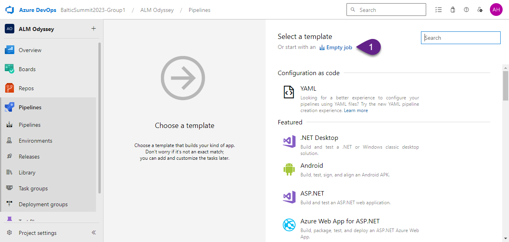

The new Pipeline is ready to be configured. Before we proceed with adding steps let's make a few configurations.

***

# 2. Configure basic parameters

1. Go to the `Get sources` scroll down and uncheck the `Shallow fetch` option.

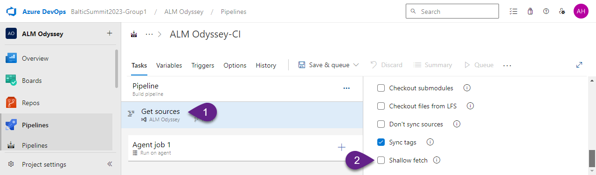

2. Go to `Agent job 1` and check the `Allow scripts to access the OAuth token` option to allow your pipeline commit changes.

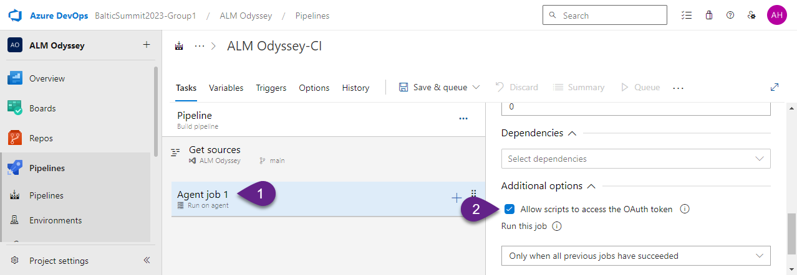

3. Open `Save& queue` drop-down and select `Save`.

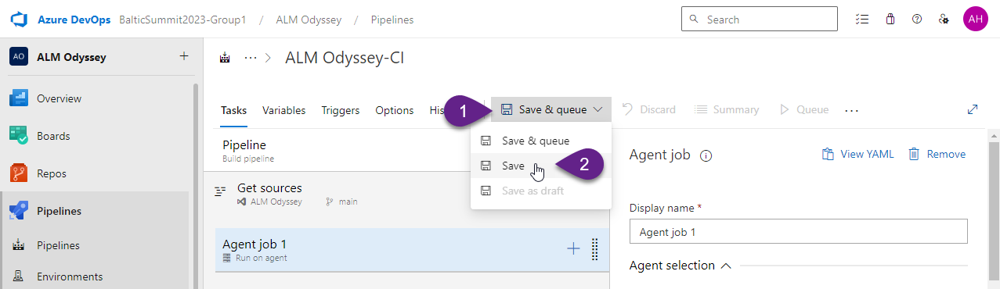

***

# 3. Add pipeline steps

1. Click on the plus icon in the `Agent job 1` tile.

2. In the search field type `power platform`.

3. Select following tasks in the sequence:
- `Power Platform Tool Installer` - this step installs Power Platform Build Tools extension to your pipeline to allow use the extension's actions
- `Power Platform Export Solution` - this step exports particular solution from your environment
- `Power Platform Unpack Solution` - this step stores the solution's code in the Azure DevOps repository

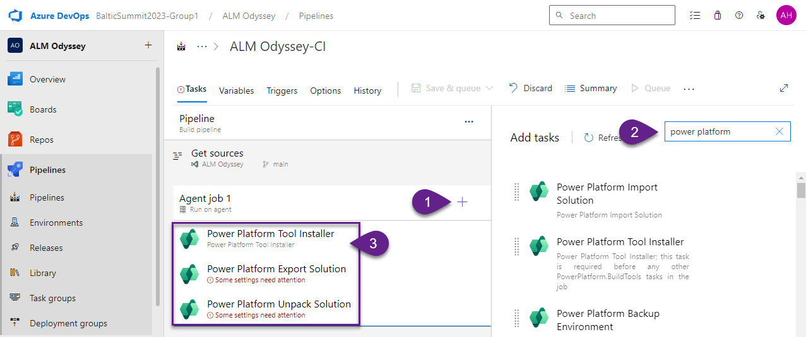

4. Then type `command line` in the search field and add the `Command Line` step. This step commit changes that you made in your Azure DevOps repository.

***

# 4. Configure pipeline tasks

## 4-1 Power Platform Export Solution

In this step we should provide information about the environment where our solution is storing, authentication information and solution's name.

In the field `Authentication type` choose `Username/password (no MFA support)`

### Field: Service connection

1. Click `Manage` next to the `Service connection` field.

2. Click `Create service connection` in the opened window.

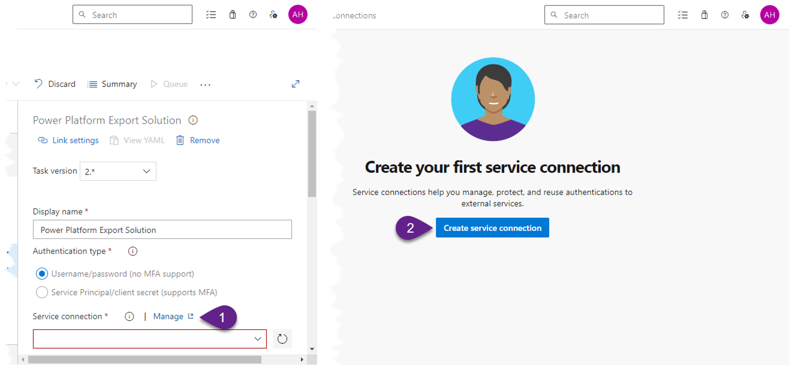

3. Choose `Generic` and click `Next`

4. Provide details for the new connection:
- `Server URL` - copy the value from the Developer Resources from the Power Apps Maker portal.
- `Username` - enter your email.
- `Password/Token Key (optional)` - enter your password,.
- `Service connection name` - `Dev`. 

Once you are ready, click `Save`.

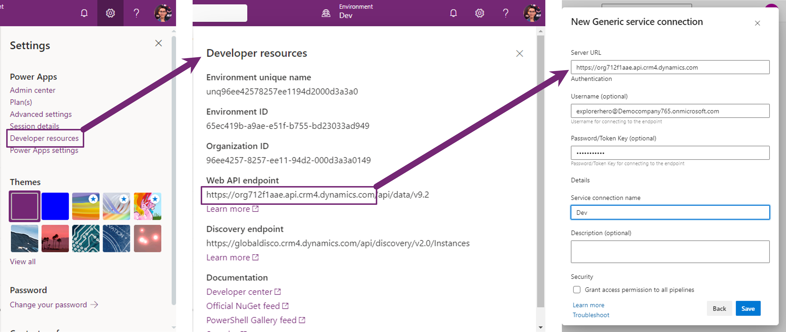

5. Go back to your pipeline, refresh `Service connection` field and select the connection `Dev` that you've created.

### Field: Solution Name

Copy to this field the following value:
`$(PowerPlatform.SolutionName)`

### Field: Solution Output File

Copy to this field the following value:
`$(Build.ArtifactStagingDirectory)\$(PowerPlatform.SolutionName)_managed.zip`

### Field: Export as Managed Solution

Mark this check box checked.

## 4-2 Power Platform Unpack Solution

### Field: Solution Input File

Copy to this field the following value:
`$(Build.ArtifactStagingDirectory)\$(PowerPlatform.SolutionName)_managed.zip`

### Field: Target Folder to Unpack Solution

Copy to this field the following value:
`$(Build.SourcesDirectory)\$(PowerPlatform.SolutionName)`

### Field: Type of Solution

Choose `Managed`

## 4-3 Command Line Script

This step will commit our changes in the repository branch.
To commit replace existing text with the following text the `Script` field:
```
echo Commit Power Platform Solution
git config user.email "YOUR EMAIL"
git config user.name "YOUR NAME"
git checkout main
git pull origin
git add --all
git commit -m "Automatic solution commit"
git push --set-upstream origin main
```

***

# 5. Set up pipeline variable

1. Go to `Variables`.

2. Click `+ Add` button. 

3. Provide the variable name `PowerPlatform.SolutionName` and its value `GalacticGuide`.

:exclamation: _Note:
The value for this variable should be the `Name` of your solution (not `Display Name`).

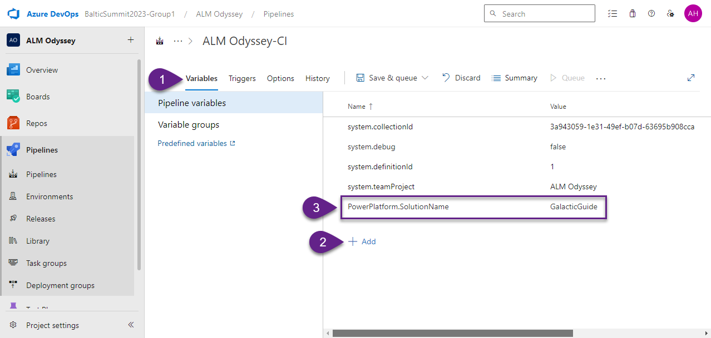

***

# 6. Run pipeline

Click `Save & queue`, and click `Save & queue` in the drop-down list.

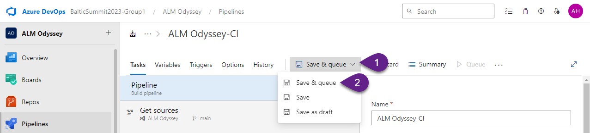

In the `Run pipeline` pop-up window click `Save and run`.

***

# 7. Check pipeline's job

Once pipeline has been started, you can click `Agent Job 1` to open the details.

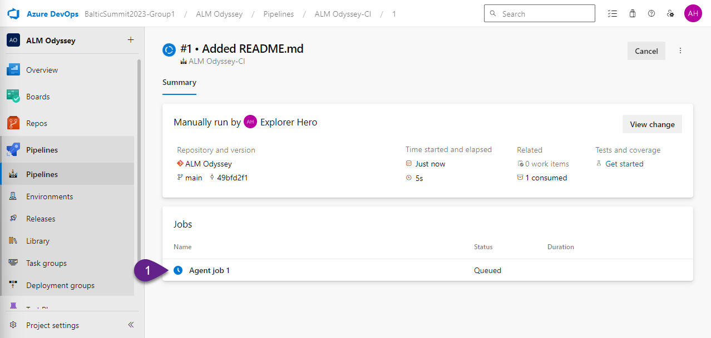

Once the pipeline finishes its job you'll receive an email notification with the status, all steps will be marked according to its status as well, and in the Azure DevOps Repo the code will appear.

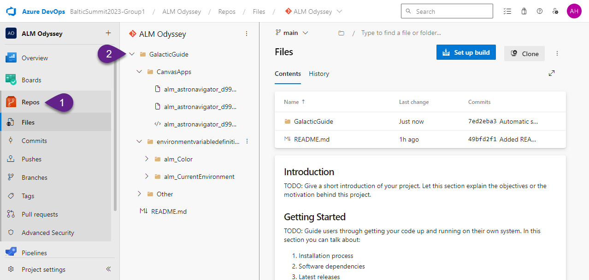

***


