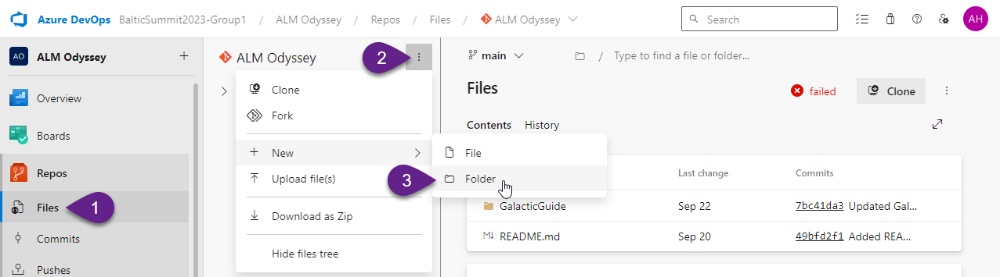

# 1. Install Microsoft Power Platform CLI

1. Open **Visual Studio Code** on your laptop.

:exclamation: _Note:
The web version of Visual Studio Code is not suitable because it does not support PAC CLI_

2. Select `Extensions` from the Activity panel.

3. In the search bar, enter `Power Platform Tools`.

4. Select `Install`. 

Once the installation is finished, restart Visual Studio Code to see the extension within the Terminal window.

***

# 2. Create a new Auth Profile

1. Select `Power Platform` from the Activity panel.

2. In the `View` drop-down select `Terminal.

3. In the `Power Platform` section click `+` icon to add a new Auth Profile.

:exclamation: _Note:
If you didn't use Power Platform CLI yet, your Auth Profiles list will be empty._

4. Enter your credentials.

5. Check that a new profile appeared and marked with star.

***

# 3. Generate Settings file

1. Enter the following command in the `Terminal` window and run it to select `Dev` environment:

`pac org select --environment 00000000-0000-0000-0000-000000000000`

:exclamation: _Note:
Please replace **00000000-0000-0000-0000-000000000000** with your environment ID. You can find the environment ID in the **Session details**:_

2. Enter the following command in the `Terminal` window and run it to export the solution **GalacticGuide**:

`pac solution export --name GalacticGuide --path C:\GalacticGuide --managed true`

:exclamation: _Note:
If you work with your own solution, replace **GalacticGuide** with the name of your solution_
_If you don't remember by heart your solution's name, run the following command to see all solutions in selected environment:_
`pac solution list`

3. Enter the following command in the `Terminal` window and run it to create a setting file:

`pac solution create-settings --solution-zip C:\GalacticGuide\GalacticGuide_managed.zip --settings-file C:\GalacticGuide\GalacticGuide.json`

***

# 4. Edit Settings file

1. Open created settings file.

:exclamation: _Note:
You can find the settings file in the folder which you enter as value for `--settings-file` last command._

The settings file should include all environments variables and connection references. In our case we have two environments variables in the solution, and don't have any connection references:

2. Enter values in 5 and 9 rows:
- in row 5 add value `#FF66C4`
- in row 9 add value `Test`

3. Save the file (press `Ctrl` + `S`). Do not close the file.

***

# 5. Add Settings file into Repository

1. Go to `Repos` in Azure DevOps.

2. Click on three dots next to the folder name `GalacticGuide`.

3. Select `+ New`, and then select `Folder`.

4. Provide the following information:
- `New folder name` - `Settings`
- `New file name` - `GalacticGuide.json`

5. Click `Create`.

6. Copy all rows from the settings file on your laptop to this `GalacticGuide.json` file, and click `Commit`.

7. In the pop-up window click `Commit`.

***

