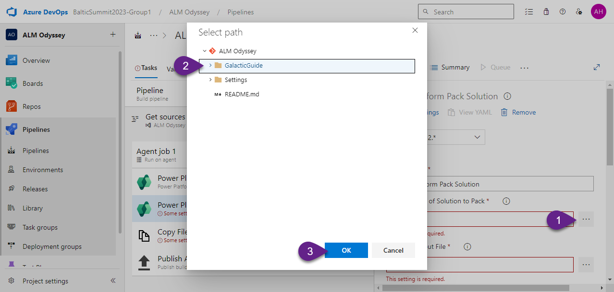

Prepare to dive into the heart of the cosmic engineering hub, the **Build Blueprint Base**. This is where our projects undergo their initial assembly, intricately pieced together for the grand voyage ahead. Here, we unravel the process of setting up build pipelines, ensuring each project component aligns perfectly for the upcoming journey.

At this base, you'll harness the techniques to craft impeccable build configurations, vital for a project's integrity as it prepares to transcend developmental phases. Feel the anticipation in the air as we lay down the foundational blocks, setting the stage for a seamless transition to the next phase of our celestial expedition.

# 1. Create Connection for Test environment

Create a new Service connection as you did in the Lab 5, but now for `Test` environment.

1. In Azure DevOps go to `Settings` and open `Service connection`.

2. Select `New service connection`.

3. Select `Power Platform` and click `Next`.

4. Fill in the form:
- `Authentication method` - `Application Id and client secret`.
- `Server URL` - get this value from `Session details` in the Power Apps Maker portal; the required value is located in the `Instance url` field.
- `Tenant Id` - `Directory (tenant) ID` that you copied during App registration creation in the Lab 5.
- `Application Id` - `Application (client) ID` that you copied during App registration creation in the Lab 5.
- `Client secret of Application Id` - Secret value that you copied during App registration creation in the Lab 5.
- `Service connection name` - `Test Service Principal`.

5. Click `Save`.

***

# 2. Create Build pipeline

1. Navigate to `Pipeline` and click `New pipeline`.

2. As we proceed during the creation of the first pipeline, select `Use the classic editor` -> click `Continue` -> `Empty job`.

3. Rename pipeline with `ALM Odyssey-Build`

4. Uncheck `Shallow fetch` in `Get source`.

5. Add the following tasks to `Agent job 1`:

- `Power Platform Tool Installer`
- `Power Platform Pack Solution`
- `Copy Files to:`
- `Publish Artifacts: drop`

***

# 3. Configure pipeline tasks

## 3-1 Power Platform Pack Solution

### Field: Source Folder of Solution to Pack

Click on three dots and select the folder `GalacticGuide`.

### Field: Solution Output File

Copy to this field the following value:
`$(Build.ArtifactStagingDirectory)\$(PowerPlatform.SolutionName)_managed.zip`

### Field: Type of Solution

Select `Managed`

## 3-2 Copy Files to:

### Field: Source Folder

Click on three dots and select the folder `Settings`.

### Field: Contents

Keep `**`.

### Field: Target Folder

Copy to this field the following value:
`$(Build.ArtifactStagingDirectory)`

## 3-3 Publish Artifact: drop

Keep fields with predefined values.

***

# 4. Set up pipeline variable

1. Go to Variables.

2. Click + Add button.

3. Provide the variable name `PowerPlatform.SolutionName` and its value `GalacticGuide`.

***

# 5. Run pipeline

1. Click `Save & queue`, and click `Save & queue` in the drop-down list.

2. In the Run pipeline pop-up window click `Save and run`.

Once the pipeline will be completed successfully the Artifact will be available:

***
