As we transition from construction to launch, welcome to the **Release Rocket Refinement Runway**. This is where our meticulously assembled projects get their final checks, ensuring they're ready to soar flawlessly in the vast expanse of the development universe. Here, we delve deep into the art of configuring releases, ensuring every component is primed for a flawless lift-off.

At this runway, master the nuances of setting up release pipelines, capturing the essence of perfection and readiness. The excitement is palpable, as we prepare our projects for their moment of glory, ensuring they take flight with precision, grace, and boundless potential in the vast cosmos of development.

# 1. Create Release

1. Navigate to `Releases`.

2. Select `New pipeline`.

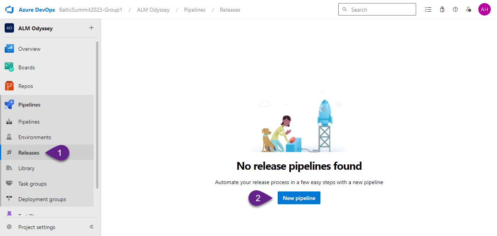

3. Select `Empty job`.

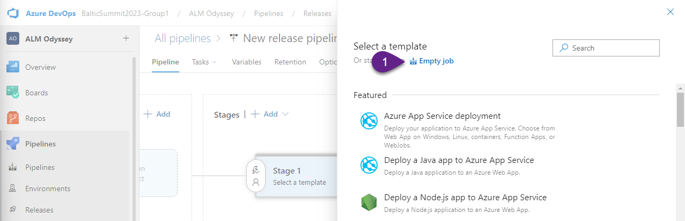

4. Close information pane.

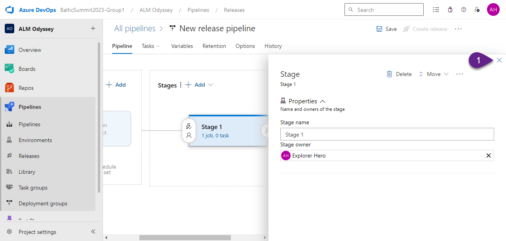

5. Click `+ Add an artifact`

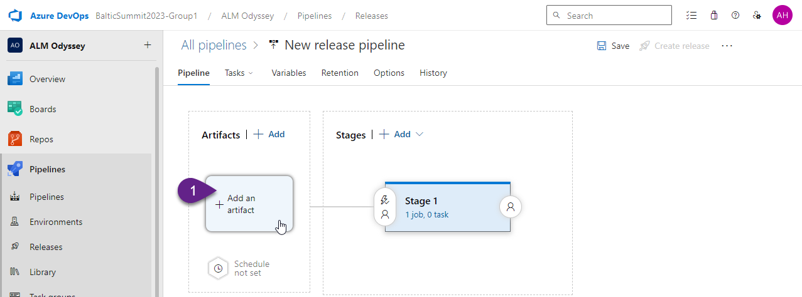

6. Fill in the following fields:
- `Source (build pipeline)` - select `ALM Odyssey-Build` (the name of the Build pipeline).
- `Source alias` - `drop`.

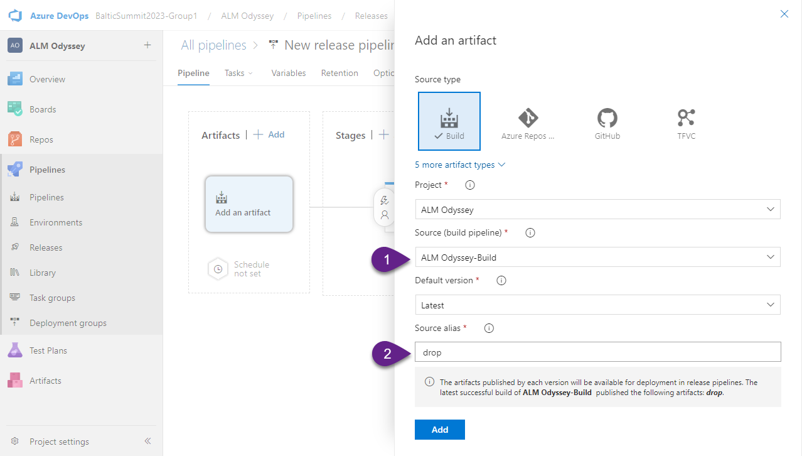

7. Click `Add`.

8. Click `1 job, 0 task`.

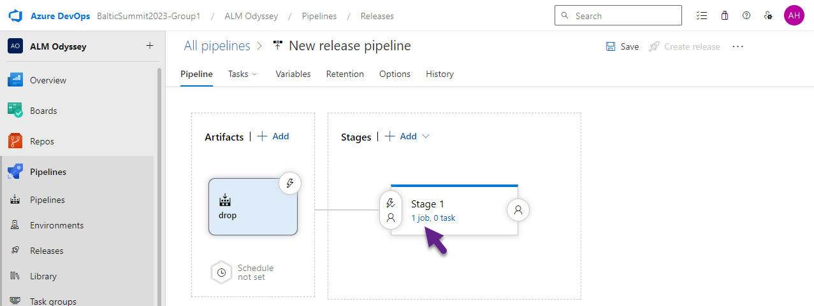

9. Add the following tasks:
- `Power Platform Tool Installer`
- `Power Platform Import Solution`

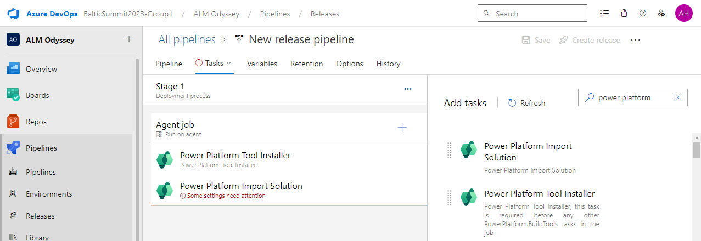

***

# 2. Configure task Power Platform Import Solution

### Filed: Authentication type

Select `Service Principal/client secret (support MFA)`

### Field: Service connection

Select `Test Service Principal`

### Field: Solution Input File

Click on three dots, select `GalacticGuide_managed.zip` and click `OK`.

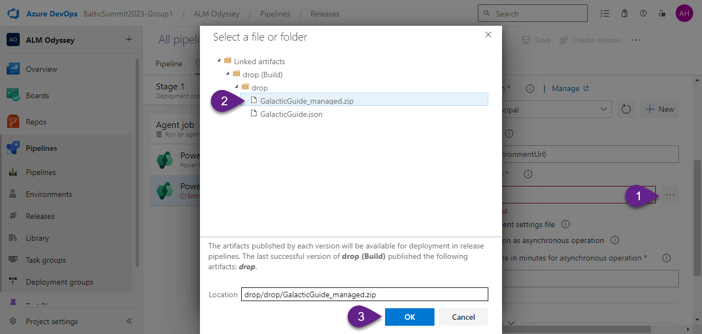

### Field: Use deployment settings file

Ensure that you check this field.

### Field: Deployment Settings File

Click on three dots, select `GalacticGuide.json` and click `OK`.

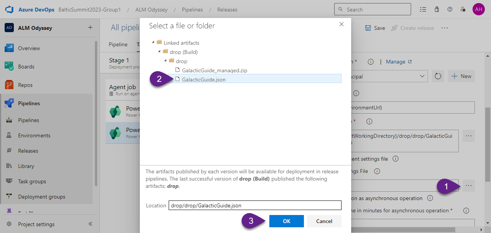

### Section: Advanced

Check `Import as a Managed solution`.

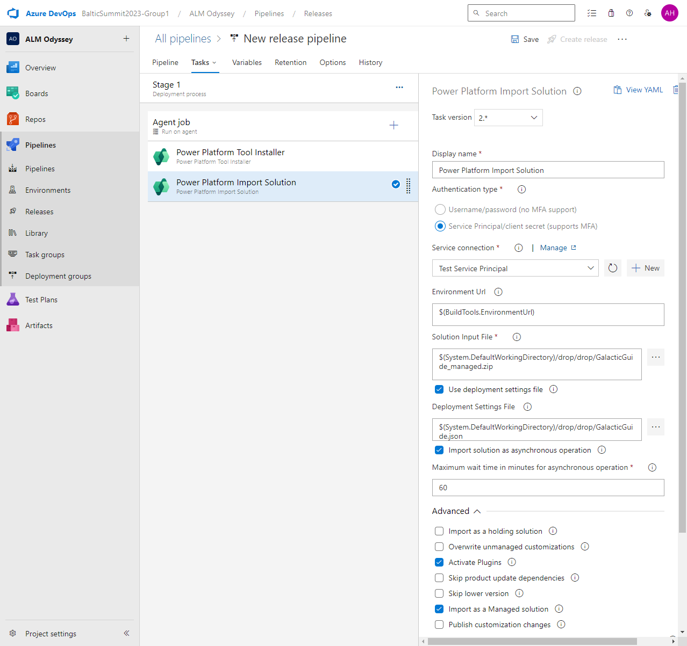

***

# 3. Save and create Release

1. Click `Save`, then click `OK`.

2. Click `Create release, then click `Create`.

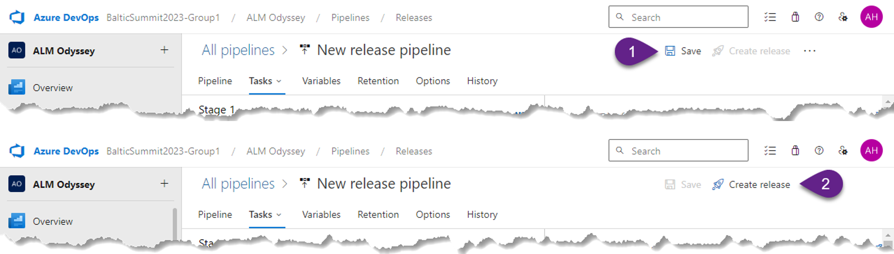

***

# 4. Check Test environment

1. Go to `Test` environment.

2. Open the solution `Galactic Guide`.

3. Open the environment variable `Color` and check that the `Current Value` is `#FF66C4` (as we defined in the Settings file).

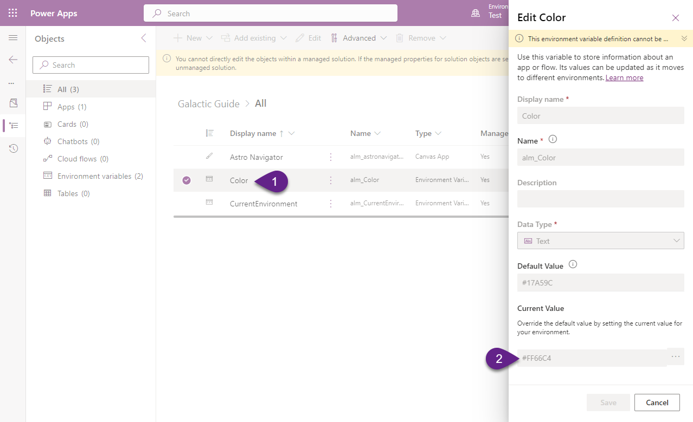

4. Share the app with your account and Play it. You should see something like this (according to your app that you created in the Lab 3):

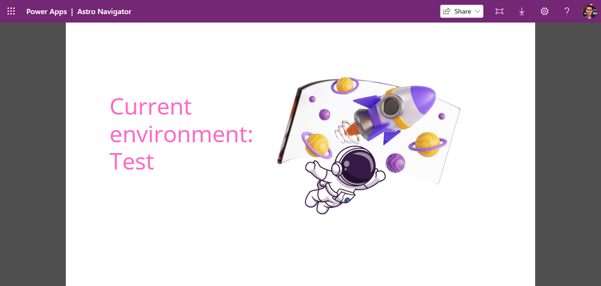

***

