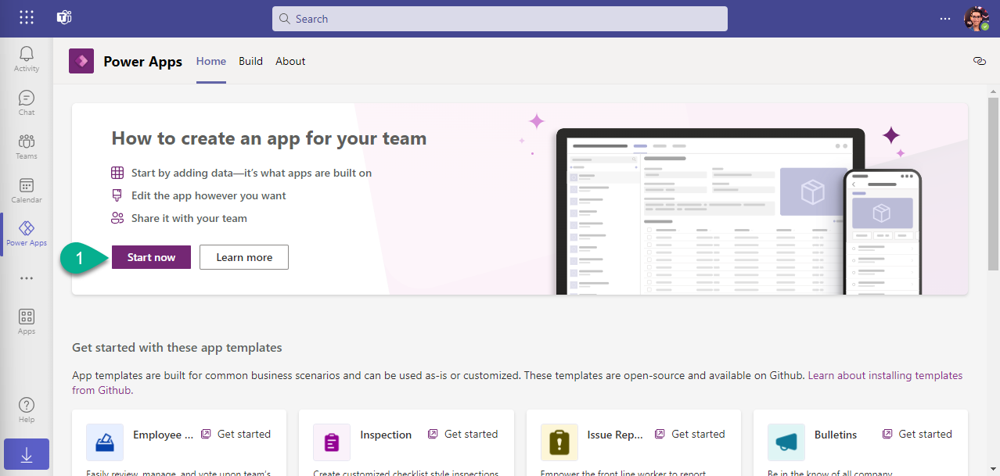
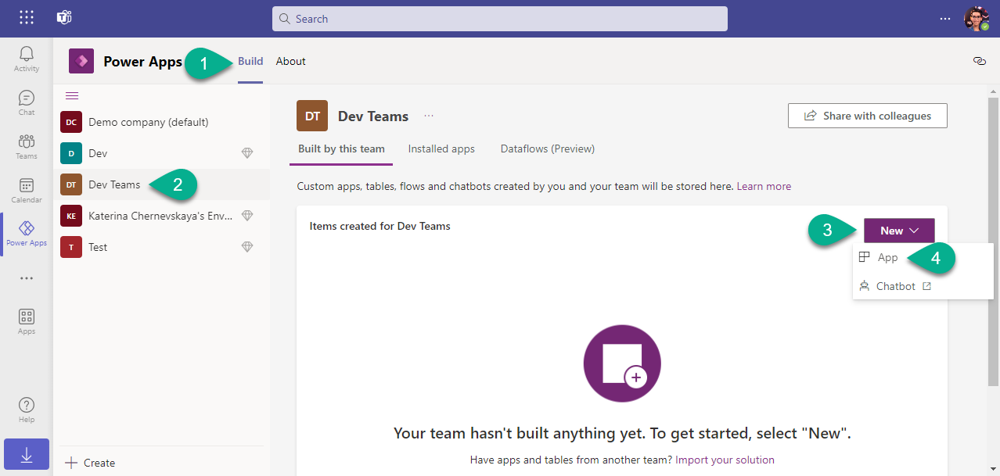

As we traverse the intricate pathways of the **Dataverse for Teams Starscape**, we anchor at the Solution Synchronization Station. Here, in the heart of the cosmos, we engage in the meticulous assembly of Dataverse for Teams solutions, laying the groundwork for our collaborative projects.

At this station, we will delve into the essence of solution preparation in Dataverse for Teams, ensuring every component aligns seamlessly, setting the stage for the upcoming CI/CD dance. Feel the vibrant energy of interconnected modules coming together, laying a strong foundation in the boundless universe of Dataverse for Teams.


# 1. Create two teams in Microsoft Teams

1. Open desktop app Microsoft Teams, or navigate to [https://teams.microsoft.com/](https://teams.microsoft.com/).

2. Navigate to `Teams`, click `Join or create a team`, select `From scratch`.


3. Select `Private`.

4. Enter a new team name `Dev Teams`, and click `Create`.


5. On the screen `Add members to Dev Teams` click `Skip`.

6.Create the second team with name `Test Teams`.

***


# 2. Prepare Dataverse for Teams

1. Click on three dots on the left-hand menu.

2. In the search field enter `power apps` and click Enter.

3. Click on the `Power Apps` icon.


4. Pin the app with right click and select `Pin`.


5. Click `Start now` on the `Home` screen.



6. Select `Dev Teams` team and click `Create`.


7. Wait while the Dataverse for Teams will be ready. You will be notified about that.

***


# 3. Create an app using Power Apps for Teams

1. Navigate to `Build`.

2. Select environment `Dev Teams`.

3. Click `New` and select `App`.



4. Enter name `TeamSpace Tracker` and click `Save`.

5. Add two controls: `Image` and `Label`.

6. Save the app and go back.


7. Click `See all` to open all components.

8. Click `+ New` and select `Environment variable`.


9. Fill in the form:
- `Display name` - `Color`
- `Data type` - `Text`
- `Default value` - `#67319C`
- `Current Value` - `#67319C`

10. Click `Save`.

12. Create the second environment variable with the following parameters:
- `Display name` - `CurrentEnvironment`
- `Data type` - `Text`
- `Default value` - `Dev`
- `Current Value` - `Dev`

13. Save for the later schema name for both Environment variables.


14. Open your Canvas App in Edit mode.

15. Navigate to `Data` and add both tables `Environment Variable Definitions` and `Environment variable Values`.

16. Adjust and position the controls so they sit side by side.

17. Configure the following properties for the `Label1`:

- `Text`:

```
"Current environment: " &
LookUp(
    'Environment Variable Values',
    'Environment Variable Definition'.'Schema Name' = "cr49e_CurrentEnvironment"
).Value
```

- `Color`:
```
ColorValue(
    LookUp(
        'Environment Variable Values',
        'Environment Variable Definition'.'Schema Name' = "cr49e_Color"
    ).Value
)
```

18. Navigate to `Media`, upload the image that you downloaded in the Lab 3.

19. Update `Image` property for `Image1` control, providing uploaded image. 

20. Save and publish the app.


21. Go back to all components screen.

***


# 4. Create a solution in Dataverse for Teams

1. In the `Build` tab click on three dots next to selected environment and select `Open in Power Apps`.


2. Click `+ New solution`.

3. Fill the form:
- `Display name` - `TeamSpace Solution`
- `Publisher` - create a new publisher with the following parameters and select it:
`Display name` - `Cosmic Creator`,
`Name` - `CosmicCreator`
`Prefix` - `alm`

4. Click `Create`.

5. Click `Add existing` and select `Canvas app` to add the app `TeamSpace Tracker`, then select `Environment variable` to add both environment variables.


:exclamation: _Note:
Uncheck_ `Include current value` _when adding Environment variables._


***


