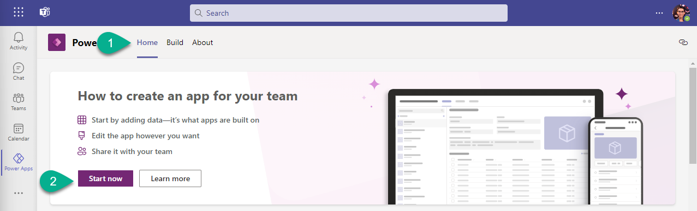

# 1. Prepare target environment

1. In Power Apps for Teams navigate to `Home` and click `Start now`.



2. Select `Test Team` and click `Create`.

***


# 2. Create a new Project in Azure DevOps

You can follow steps in the Lab 4 to create a new project with name `Dataverse for Teams Cosmos` in your Azure DevOps Organization.

***


# 3. Create pipeline

:exclamation: _Note:
In this lab, we will construct a single pipeline that encompasses all steps: exporting the solution, storing it in the repository, and importing it into the target environment._

1. Navigate to `Pipelines` and click `Create Pipeline`.

2. Select `Use the classic editor`, click `Continue`, select `Empty job`.

3. For `Get sources` uncheck `Shallow fetch`. For `Agent job 1` check `Allow scripts to access the OAuth token`.

4. Add the following tasks:

- `Power Platform Tool Installer`
- `Power Platform Export Solution`
- `Power Platform Unpack Solution`
- `Command Line`
- `Power Platform Pack Solution`
- `Power Platform Import Solution`


***

# 4. Configure pipeline tasks

## 4-1 Power Platform Export Solution

### Field: Authentication type

`Username/password (no MFA support)`

### Field: Service connection

1. Click `Manage`.

2. Create a new Service connection `Generic` type.

3. Once created - select this connection.

### Field: Solution Name
`$(PowerPlatform.SolutionName)`

### Field: Solution Output File
`$(Build.ArtifactStagingDirectory)\$(PowerPlatform.SolutionName).zip`


## 4-2 Power Platform Unpack Solution

### Field: Solution Input File
`$(Build.ArtifactStagingDirectory)\$(PowerPlatform.SolutionName).zip`

### Field: Target Folder to Unpack Solution
`$(Build.SourcesDirectory)\$(PowerPlatform.SolutionName)`


## 4-3 Command Line

### Field: Script
```
echo Commit Power Platform Solution
git config user.email "YOUR EMAIL"
git config user.name "YOUR NAME"
git checkout main
git pull origin
git add --all
git commit -m "Automatic solution commit"
git push --set-upstream origin main
```

## 4-4 Power Platform Pack Solution

### Field: Source Folder of Solution to Pack
`$(PowerPlatform.SolutionName)`

### Field: Solution Output File
`$(Build.ArtifactStagingDirectory)\$(PowerPlatform.SolutionName).zip`


## 4-5 Power Platform Import Solution

### Field: Service connection

1. Click `Manage`.

2. Create a new Service connection `Generic` type.

3. Once created - select this connection.
:exclamation: _Note:
Make sure that you select Server Url from the_ `Test Teams` _environment_


### Field: Solution Input File
`$(Build.ArtifactStagingDirectory)\$(PowerPlatform.SolutionName).zip`

***


# 5. Set up pipeline variable

Name:
`PowerPlatform.SolutionName`

Value:
`TeamSpaceSolution`

***


# 6. Run pipeline

1. Click `Save & queue` and check the result.

2. To check the result, open `Build` tab in Power Apps for Teams, select the target team `Test Teams`. The solution's components should the there.

:exclamation: _Note:
In the Power Apps Studio you won't see the solution._

***


