# 1. Prepare environments

1. Create or select environments that will be used in pipelines.

:exclamation: _Note:
In this Lab we will use three environments:_

| Environment Purpose | Environment type | Environment name |
|--|--|--|
| Host | Default | Citizen Developer Academy Ltd (default) |
| Development | Developer | Development |
| Production | Production | Production |

2. Navigate to [Power Platform admin center](https://admin.powerplatform.microsoft.com/). 

3. Select `Environments` in left-hand menu. 

4. Select the check mark to the left of the target environment.

5. On the command bar, select `Enable Managed Environments`.

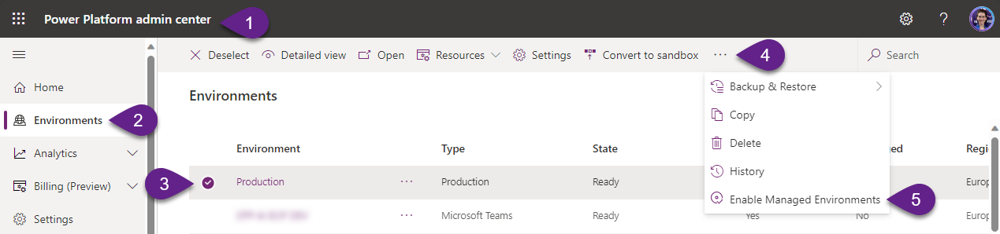

6. Leave predefined values for all settings (later you will be able to configure the settings), and click `Enable`.

***

# 2. Install the pipelines app in the Host environment

1. In `Power Platform admin center` navigate to `Environments`, open your Host environment.

2. Select `Resources` -> `Dynamics 365 apps`.

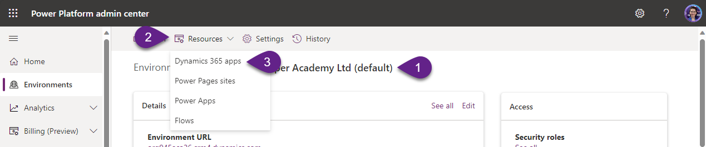

3. Select `Install app` and scroll down within the right-side panel until you find `Power Platform Pipelines`. Select Next.

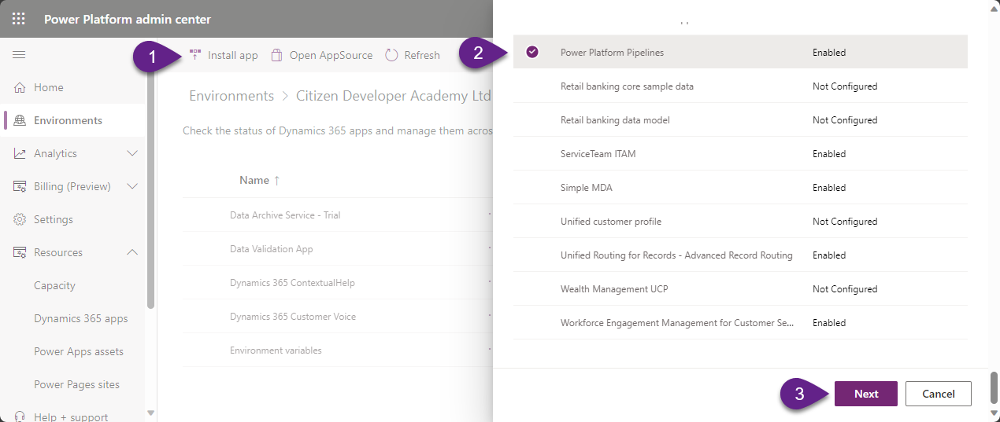

4. If you agree, accept the terms, and then select `Install`.

Once installed, the deployment pipelines configuration application will appear in the list of installed apps.

***

# 3. Configure a deployment pipeline

1. Copy the environment IDs of the `Development` and `Production` environments. You’ll need these later.

:exclamation: _Note:
To copy environment ID, open the environment in Power Platform admin center, and copy value from the field_ `Environment ID`.

2. Navigate to [Power Apps portal](https://make.powerapps.com) and select your Host environment (`Default` in our case).

3. Navigate to `Apps` and `Play` the `Deployment Pipeline Configuration` app.

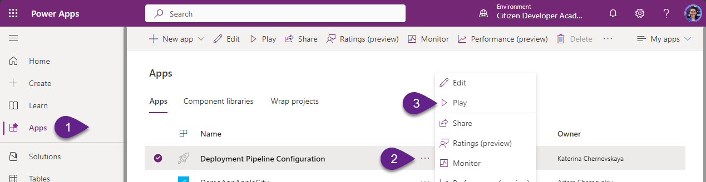

4. Select `Environments` on the left pane, and then select `+ New` to create the environment records in Dataverse.

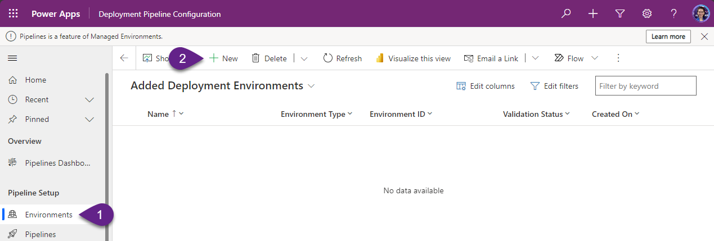

5. Fill in the form:
- `Name` - `Development`.
- `Environment Type` - Select `Development Environment`.
- `Environment Id` - Be sure to select the correct ID.

6. Select `Save`.

7. Refresh the form, then verify `Validation Status` equals `Success`.

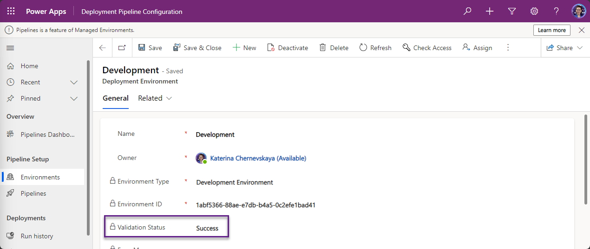

8. Repeat steps 4 - 7 to create the second environment:
- `Name` - `Production`.
- `Environment Type` - Select `Target Environment`.
- `Environment Id` - Be sure to select the correct ID.

9. Select `Pipelines` on the left navigation pane, and then select `+ New` to create a new deployment pipeline. Fill in the form:
- `Name` - `Solution deployment`.
- `Description` - Optionally, enter a meaningful description for the pipeline.

10. Select `Save`.

11. Within the `Linked Development Environments` grid, select `Add Existing Development Environment`, then associate `Development` environment.

:exclamation: _Note:_
`Linked Development Environments` _grid appears after you select_ `Save`.

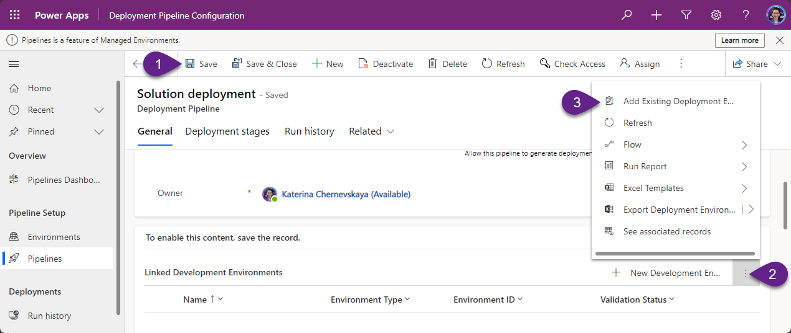

12. Within the `Deployment Stages` grid, select `New Deployment Stage`, to display the quick create pane.

13. Enter the details for `Production` environment:

- `Name` - `Deploy to Production`.
- `Description` - Optional description for the stage.
- `Previous Deployment Stage` - Left blank.
- `Target Deployment Environment` - select `Production`.

14. Select `Save and Close`.

Configured pipeline:

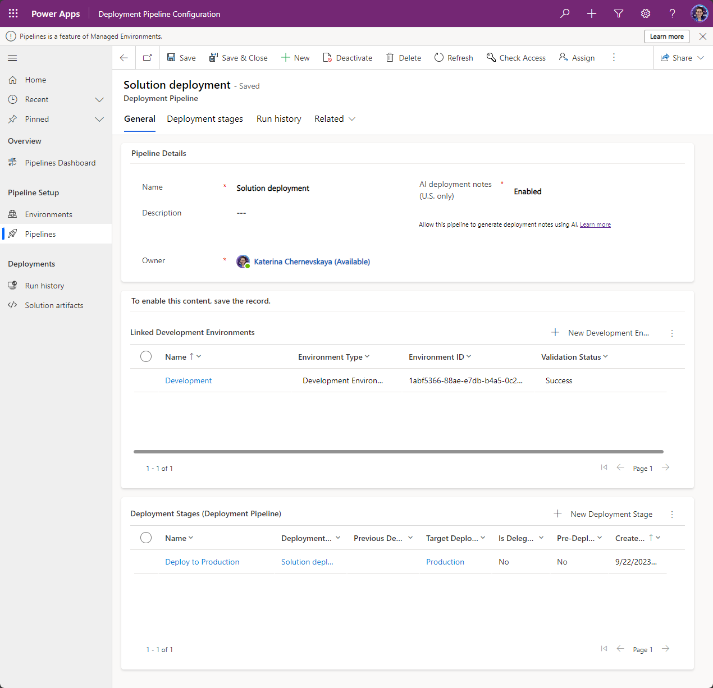

***

# 4. Grant access

Pipeline security is managed within the host environment by assigning security roles. Additionally, users must currently have access to all environments associated with a pipeline in order to create or run the pipeline.

When you installed the Power Platform pipelines application, two security roles were added:

- `Deployment Pipeline User`: Has privileges to run pipelines that have been shared with them.
- `Deployment Pipeline Administrator`: Has full control over all pipeline configuration, without needing system administrator security role membership.

Learn more [here](https://learn.microsoft.com/en-us/power-platform/alm/set-up-pipelines#grant-access-to-edit-or-run-pipelines) how to share pipelines with makers and administrators.

***

# 5. Run a pipeline

1. Sign in to a Power Platform environment using [Power Apps](https://make.powerapps.com) and select `Development` environment.

2. Go to `Solutions` and open an unmanaged solution to deploy (in our example we select `ALM Odyssey`).

3. From the Solutions area select `Pipelines` from the left navigation pane.

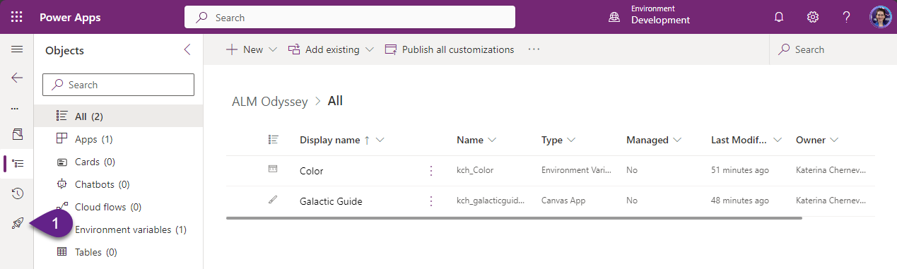

4. Select `Deploy here`, and the deployment pane appears on the right.

:exclamation: _Note:
If you will have more than one Stage, you will need select the stage to deploy to._

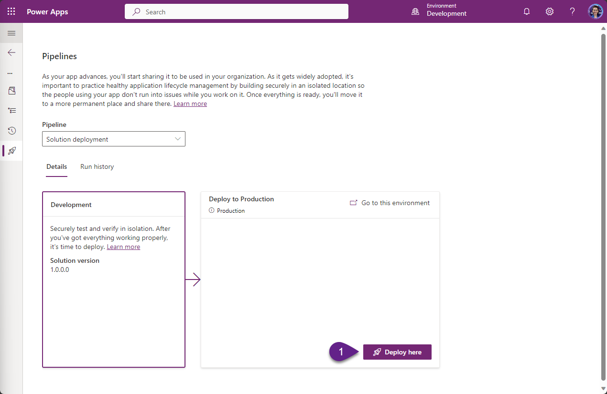

5. Choose to deploy `Now`, and then select `Next`. 

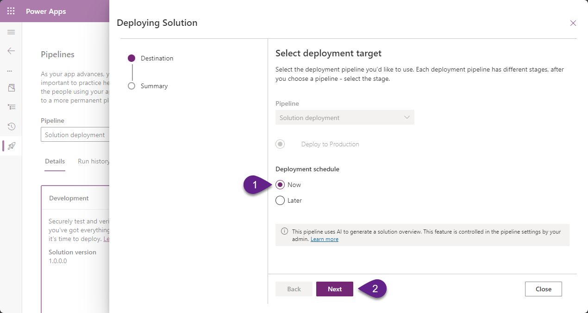

:exclamation: _Note:
This initiates validation of the solution. This validation can also be referred to as preflight checks. Missing dependencies and other common issues are checked that might cause a deployment to fail._

6. Review the summary of the deployment and optionally add deployment notes.
Select `Deploy`. This initiates an automated deployment to the target environment.

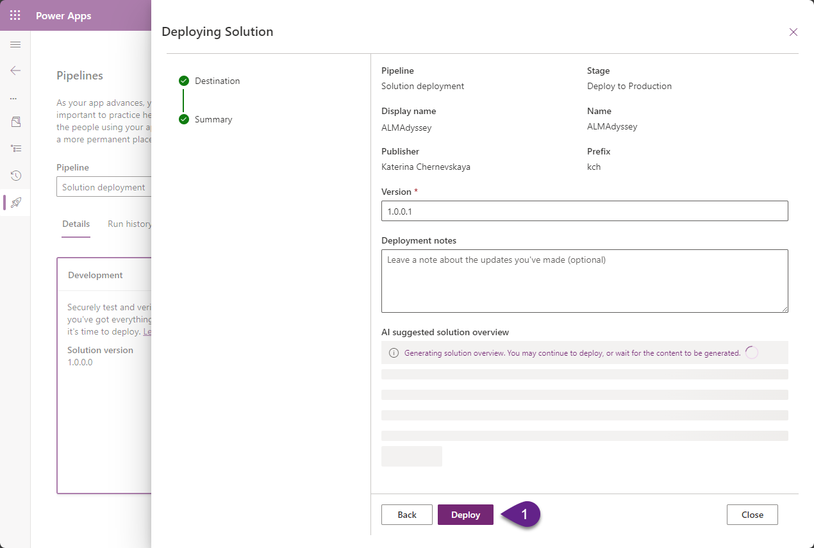

***

# 6. Check the result

1. Once the deployment completed, navigate to `Production` environment.

2. Run deployed app.

***
